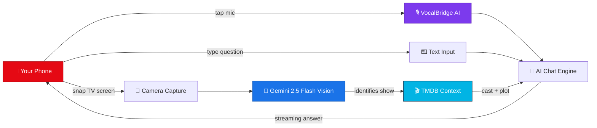
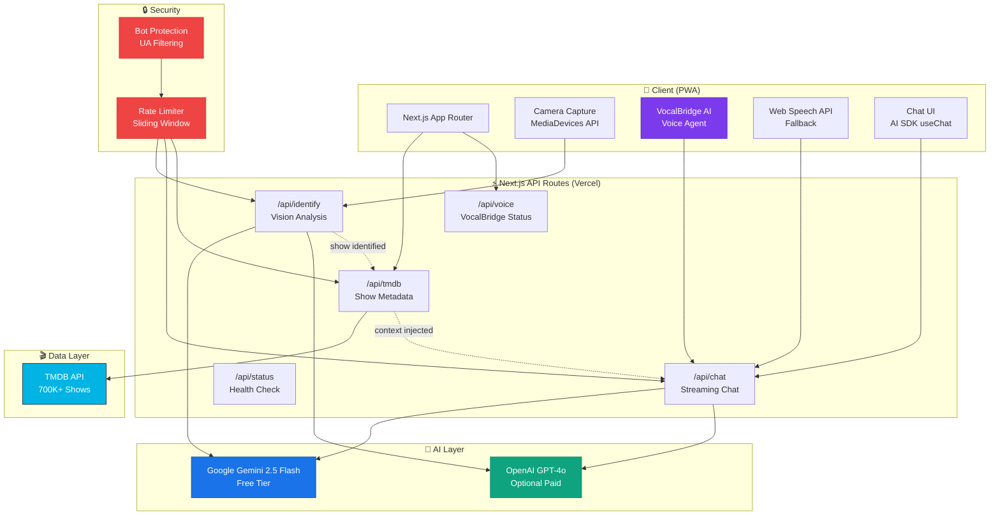
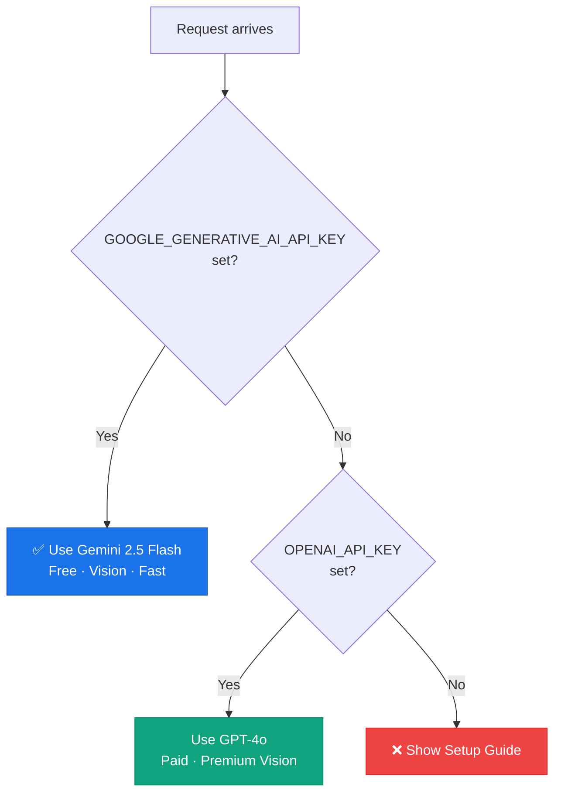
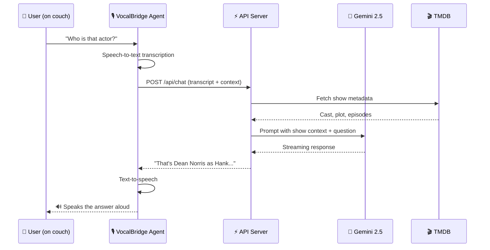
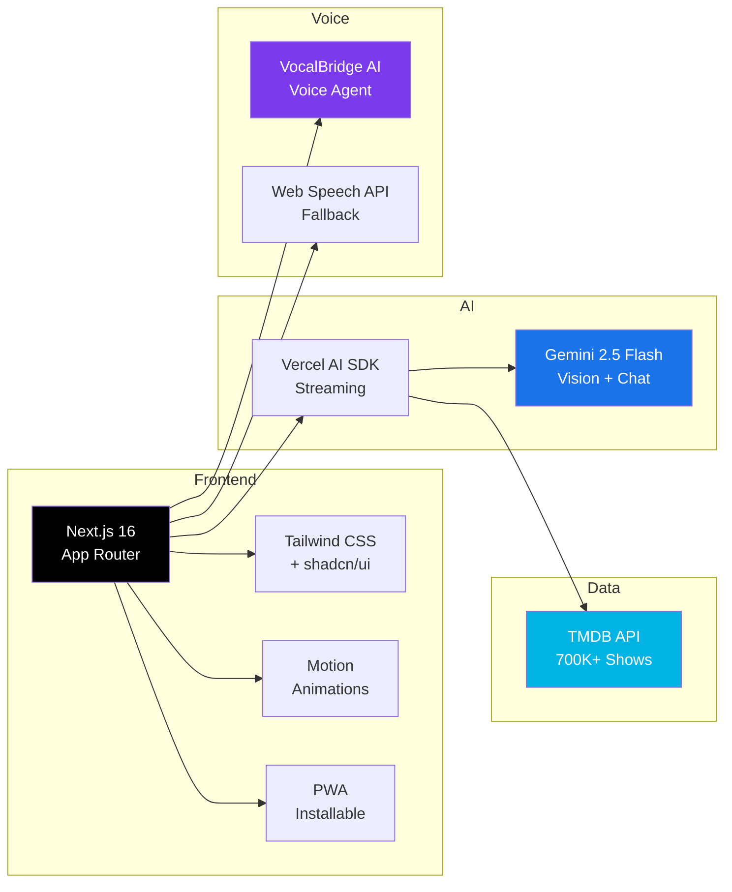
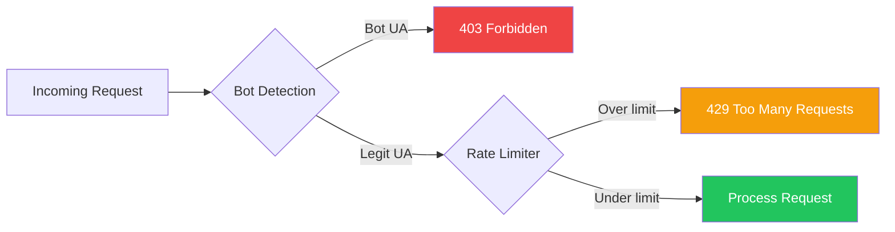

# Netflix & What Now

> **Point your phone at the TV. Ask anything.**

[](https://vercel.com/new/clone?repository-url=https://github.com/venkata-srinivasan/netflix-and-what-now&env=GOOGLE_GENERATIVE_AI_API_KEY&envDescription=Free%20Gemini%20API%20key%20from%20aistudio.google.com/apikey)
[](LICENSE)

An open-source AI companion for watching TV shows and movies. Snap a screenshot of your TV screen, then ask questions using voice or text -- who's that actor, what just happened, what did I miss?

**No paid API keys required.** Powered by Google Gemini (free tier) + VocalBridge AI.

---

## How It Works



### The Flow

```
You're watching Breaking Bad on your couch
          │
          ▼
┌─────────────────────────────────────┐
│  📸  Snap your TV screen            │
│  "Who is that bald guy?"            │
└──────────────┬──────────────────────┘
               │
               ▼
┌─────────────────────────────────────┐
│  🧠  Gemini 2.5 Flash Vision       │
│  Identifies: Breaking Bad S3E7     │
│  Actors: Dean Norris as Hank       │
│  Scene: DEA office confrontation   │
└──────────────┬──────────────────────┘
               │
               ▼
┌─────────────────────────────────────┐
│  🎬  TMDB loads full context        │
│  Cast: Bryan Cranston, Aaron Paul   │
│  Plot: Walt's double life unravels │
│  Rating: 9.5/10                     │
└──────────────┬──────────────────────┘
               │
               ▼
┌─────────────────────────────────────┐
│  💬  AI answers with context        │
│  "That's Dean Norris — he plays    │
│   Hank Schrader, Walt's brother-   │
│   in-law and DEA agent. You might  │
│   know him from Under the Dome."   │
└─────────────────────────────────────┘
```

---

## Architecture



### AI Model Selection



---

## VocalBridge AI Integration

[VocalBridge AI](https://vocalbridgeai.com) is the voice engine that makes this app hands-free. Instead of typing while watching TV, you talk to it.

### How VocalBridge Fits In



### VocalBridge Architecture

```
┌──────────────────────────────────────────────────┐
│                 VocalBridge AI                    │
│                                                  │
│  ┌──────────┐  ┌──────────┐  ┌──────────────┐  │
│  │  Voice    │  │  Agent   │  │  MCP Server   │  │
│  │  Input    │──│  Engine  │──│  Integration  │  │
│  │  (STT)   │  │          │  │  (TMDB tools) │  │
│  └──────────┘  └──────────┘  └──────────────┘  │
│       │              │              │            │
│       ▼              ▼              ▼            │
│  ┌──────────┐  ┌──────────┐  ┌──────────────┐  │
│  │  Voice   │  │  Session │  │  API Tools    │  │
│  │  Output  │  │  Logs &  │  │  (HTTP calls  │  │
│  │  (TTS)   │  │  History │  │   to our API) │  │
│  └──────────┘  └──────────┘  └──────────────┘  │
└──────────────────────────────────────────────────┘
                       │
            ┌──────────┼──────────┐
            ▼          ▼          ▼
        📱 Web    📞 Phone    🔌 REST API
```

### Voice Provider Fallback

| Feature | VocalBridge AI | Web Speech API |
|---------|---------------|----------------|
| Setup | API key required | Zero setup |
| Cost | Free tier available | Free (browser-native) |
| Quality | High — dedicated voice agent | Good — browser dependent |
| Bidirectional | Yes — speaks answers back | Manual (Speech Synthesis) |
| Session logs | Yes — transcripts + analytics | No |
| MCP tools | Yes — can call TMDB directly | No |
| Offline | No | Partial (recognition only) |
| Browser support | All (REST API) | Chrome, Edge, Safari |

The app automatically detects which provider is available and uses VocalBridge when configured, falling back to Web Speech API.

---

## Quick Start

### 1. Get a free API key (30 seconds)

Go to **[aistudio.google.com/apikey](https://aistudio.google.com/apikey)** and create a free Gemini API key. No credit card needed.

### 2. Clone and configure

```bash
git clone https://github.com/venkata-srinivasan/netflix-and-what-now.git
cd netflix-and-what-now
npm install
cp .env.example .env.local
```

Edit `.env.local` and paste your Gemini key:

```env
GOOGLE_GENERATIVE_AI_API_KEY=your_key_here
```

### 3. Run

```bash
npm run dev
```

Open `localhost:3000` on your phone (same WiFi) and start watching.

### One-Click Deploy

[](https://vercel.com/new/clone?repository-url=https://github.com/venkata-srinivasan/netflix-and-what-now&env=GOOGLE_GENERATIVE_AI_API_KEY&envDescription=Free%20Gemini%20API%20key%20from%20aistudio.google.com/apikey)

---

## Environment Variables

| Variable | Required | Cost | What it does |
|----------|----------|------|--------------|
| `GOOGLE_GENERATIVE_AI_API_KEY` | **Yes** | **Free** | Gemini 2.5 Flash — vision + chat (15 RPM free) |
| `TMDB_API_KEY` | No | Free | Show search, cast info, episode details |
| `VOCALBRIDGE_API_KEY` | No | Free tier | Premium voice agent (VocalBridge AI) |
| `OPENAI_API_KEY` | No | Paid | GPT-4o alternative if you prefer OpenAI |

---

## Tech Stack



| Layer | Technology | Why |
|-------|-----------|-----|
| Framework | [Next.js 16](https://nextjs.org) App Router | SSR + API routes, Vercel-native |
| AI | [AI SDK](https://sdk.vercel.ai) + [Gemini 2.5 Flash](https://ai.google.dev) | Free vision + chat, streaming |
| Voice | [VocalBridge AI](https://vocalbridgeai.com) | Bidirectional voice agent |
| Voice fallback | [Web Speech API](https://developer.mozilla.org/en-US/docs/Web/API/Web_Speech_API) | Browser-native, zero cost |
| Show data | [TMDB API](https://www.themoviedb.org) | 700K+ shows, cast, episodes |
| Camera | [MediaDevices API](https://developer.mozilla.org/en-US/docs/Web/API/MediaDevices) | Browser-native camera |
| UI | [Tailwind CSS](https://tailwindcss.com) + [shadcn/ui](https://ui.shadcn.com) | Accessible components |
| Animations | [Motion](https://motion.dev) | Scroll reveals, parallax, micro-interactions |
| Security | Custom rate limiter + bot protection | Sliding window + UA filtering |
| Testing | [Vitest](https://vitest.dev) | 15 integration tests |

---

## Project Structure

```
netflix-and-what-now/
├── src/
│   ├── app/
│   │   ├── page.tsx                    # Landing page (Netflix cinematic design)
│   │   ├── (app)/watch/page.tsx        # Main app — camera + chat + voice
│   │   ├── layout.tsx                  # Root layout, PWA, dark theme
│   │   ├── api/
│   │   │   ├── chat/route.ts           # Streaming AI chat (rate-limited)
│   │   │   ├── identify/route.ts       # Vision AI — identifies show from screenshot
│   │   │   ├── tmdb/route.ts           # TMDB search + details proxy
│   │   │   ├── voice/route.ts          # VocalBridge status + agent info
│   │   │   └── status/route.ts         # Health check — are API keys configured?
│   │   ├── sitemap.ts                  # Dynamic sitemap
│   │   ├── robots.ts                   # Robots.txt
│   │   ├── opengraph-image.tsx         # Dynamic OG image
│   │   ├── error.tsx                   # Error boundary
│   │   ├── not-found.tsx               # 404 page
│   │   └── loading.tsx                 # Loading skeleton
│   ├── components/
│   │   ├── camera-capture.tsx          # Camera + file upload
│   │   ├── voice-button.tsx            # Voice input (VocalBridge / Web Speech)
│   │   ├── show-context.tsx            # Current show display card
│   │   ├── device-mockup.tsx           # iPad / browser mockup components
│   │   ├── setup-guide.tsx             # Setup modal for unconfigured apps
│   │   └── ui/                         # shadcn/ui components
│   ├── hooks/
│   │   ├── use-camera.ts               # Camera capture hook
│   │   ├── use-voice.ts                # Web Speech API hook
│   │   └── use-vocalbridge.ts          # VocalBridge AI hook
│   └── lib/
│       ├── ai-provider.ts              # Model selection (Gemini / OpenAI)
│       ├── vocalbridge.ts              # VocalBridge REST API client
│       ├── tmdb.ts                     # TMDB API helpers
│       ├── rate-limit.ts               # Sliding window rate limiter
│       ├── bot-protection.ts           # Bot detection + IP rate limiting
│       └── utils.ts                    # cn() utility
├── __tests__/                          # 15 Vitest integration tests
├── public/
│   ├── manifest.json                   # PWA manifest
│   ├── sw.js                           # Service worker
│   └── icon-*.png                      # PWA icons
├── .env.example                        # Environment template
├── CONTRIBUTING.md                     # Contributor guidelines
└── LICENSE                             # MIT
```

---

## Security



- **Bot protection** — blocks scrapers, curl, Postman; allows Googlebot, social previews
- **Rate limiting** — sliding window per IP (120/hr chat, 30/hr vision, 200/hr TMDB)
- **No data stored** — no database, no user tracking, no cookies
- **BYOK** — API keys stay on your server, never sent to the client

---

## Roadmap

- [ ] Full VocalBridge bidirectional voice agent with MCP tools
- [ ] Audio fingerprinting (auto-detect what's playing via phone mic)
- [ ] Smart TV integration (Roku, Fire TV, Samsung)
- [ ] Conversation memory across sessions
- [ ] Multi-language support
- [ ] Episode timeline scrubber
- [ ] Actor face recognition in screenshots
- [ ] Alexa / Google Home skill
- [ ] Browser extension for laptop viewing

---

## Contributing

Contributions welcome! See [CONTRIBUTING.md](CONTRIBUTING.md).

```bash
npm run dev        # Dev server
npm run build      # Production build
npm run lint       # ESLint
npm test           # Vitest (15 tests)
```

---

## License

[MIT](LICENSE)

## Credits

- [VocalBridge AI](https://vocalbridgeai.com) — Voice agent platform
- [Google Gemini](https://ai.google.dev) — Free vision + chat AI
- [TMDB](https://www.themoviedb.org) — Movie/TV database
- [Vercel](https://vercel.com) — AI SDK + hosting
- [shadcn/ui](https://ui.shadcn.com) — UI components
- [Motion](https://motion.dev) — Animations
